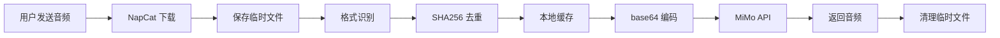

<div align="center">


</div>

> **⚠️ 项目状态：暂停开发**
>
> 当前版本存在已知问题（克隆流程中 LLM 事件阻断与 AstrBot 管道机制冲突、`meme_manager` 插件事件传播干扰等），因时间关系暂时无法处理。核心功能（TTS 合成、音色管理）可用，但克隆流程的交互体验有待修复。欢迎提交 PR 或 Issue。

# 🎤 MiMo VoiceClone TTS

基于 **小米 MiMo-V2.5-TTS-VoiceClone** 引擎的 AstrBot 语音克隆插件。

只需 **几秒参考音频** 即可克隆任意音色，让你的聊天机器人用自定义声音「开口说话」。

---

## ✨ 功能特性

| 特性 | 说明 |
|------|------|
| 🎯 **一键克隆** | 发送 3-10 秒语音即可克隆，无需训练、无需等待 |
| 📡 **智能下载** | 通过 NapCat `get_record` API 下载音频，自动格式转换 |
| 📋 **分步反馈** | 克隆全程实时告知状态：下载中 → 识别成功 → 克隆中 → 已完成 |
| 🗂️ **多音色管理** | 支持保存、切换、删除多个音色，随时更换 |
| 👥 **管理员管理** | WebUI 可配置管理员用户列表，权限与系统管理员叠加 |
| 🎭 **风格控制** | 支持情绪描述（开心/温柔/疲惫）与方言（东北话/粤语/四川话） |
| 🔊 **多格式输出** | WAV / MP3 / PCM16 自由切换 |
| 🌐 **跨平台兼容** | QQ、Telegram、Discord、KOOK、钉钉、飞书等 10+ 平台 |
| 📦 **轻量去重** | SHA256 指纹去重，重复音频自动识别 |

---

## 📂 项目结构

```
astrbot_plugin_mimo_tts/
├── main.py                # 插件入口，8 个命令处理器
├── mimo_client.py         # MiMo API 客户端（OpenAI SDK 封装）
├── voice_manager.py       # 音色 CRUD + 本地缓存
├── metadata.yaml          # AstrBot 插件元数据
├── _conf_schema.json      # WebUI 配置面板定义
├── requirements.txt       # Python 依赖
├── README.md              # 项目文档
└── .gitignore
```

---

## 🚀 快速开始

### 1. 获取 API Key

前往 [小米 MiMo 开放平台](https://platform.xiaomimimo.com/#/console/api-keys) 注册获取 API Key。

> 公测期间 **免费**，无需付费即可使用。

### 2. 安装插件

```bash
cd AstrBot/data/plugins/
git clone https://github.com/Ayleovelle/astrbot_plugin_mimo_tts.git
```

然后在 AstrBot **WebUI → 插件管理** 中加载插件。

### 3. 配置 API Key

```bash
# 方式一：环境变量
export MIMO_API_KEY="your_api_key_here"

# 方式二：聊天框命令
/mimo_config apikey <你的Key>
```

### 4. 开始使用

```
/mimo_clone 我的声音          ← 发送命令
（60秒内发送语音消息）         ← 发送参考音频
                              ← 插件：下载中... → 识别成功 → 克隆中... → 已完成！
确认                          ← 确认克隆
/mimo_tts 你好世界             ← 用克隆音色合成语音
```

---

## 📖 命令参考

### 🎯 核心功能

| 命令 | 说明 | 示例 |
|------|------|------|
| `/mimo_clone <名称>` | 开始克隆流程（随后发送音频） | `/mimo_clone 小明的声音` |
| `/mimo_clone_end` | 终止当前克隆流程 | `/mimo_clone_end` |
| `/mimo_tts <文本>` | 将文本转为语音 | `/mimo_tts 今天天气真好` |

### 🗂️ 音色管理

| 命令 | 权限 | 说明 | 示例 |
|------|------|------|------|
| `/mimo_voices` | 所有人 | 列出所有已克隆的音色 | `/mimo_voices` |
| `/mimo_my_voice` | 管理员 | 列出已克隆音色名称 | `/mimo_my_voice` |
| `/mimo_set_voice <名称>` | 所有人 | 切换当前使用的音色 | `/mimo_set_voice 小美` |
| `/mimo_voice_delete <名称>` | 管理员 | 删除音色（需密码确认） | `/mimo_voice_delete 旧音色` |

### 🎭 风格与配置

| 命令 | 说明 | 示例 |
|------|------|------|
| `/mimo_style <描述>` | 设置情绪/方言风格 | `/mimo_style 东北话` |
| `/mimo_style none` | 清除风格设置 | `/mimo_style none` |
| `/mimo_config` | 查看当前配置 | `/mimo_config` |
| `/mimo_config apikey <Key>` | 更换 API Key | `/mimo_config apikey sk-xxx` |
| `/mimo_config format <fmt>` | 切换音频格式 | `/mimo_config format mp3` |

---

## 🔄 克隆流程



---

## 🛠 技术栈

| 类别 | 技术 |
|------|------|
| 语言 | Python 3.10+ |
| 框架 | AstrBot >= 4.16 |
| API | Xiaomi MiMo-V2.5-TTS-VoiceClone |
| HTTP | OpenAI SDK (`openai>=1.30`) |
| 异步 | aiohttp >= 3.9 |
| 音频 | WAV / MP3 / PCM16（24kHz） |

---

## ❓ 常见问题

<details>
<summary><b>支持哪些音频格式作为参考？</b></summary>

WAV、MP3 均可，建议 3-10 秒、发音清晰即可。支持语音消息和音频文件两种上传方式。
</details>

<details>
<summary><b>需要付费吗？</b></summary>

MiMo API 当前处于 **公测期免费**，后续收费政策请关注 [小米 MiMo 开放平台](https://platform.xiaomimimo.com) 公告。
</details>

<details>
<summary><b>克隆的音色保存在哪里？</b></summary>

参考音频缓存于插件 `data/voices/` 目录，每个音色约 100-500KB。元数据索引存储在 `mimo_tts_voices.json`。
</details>

<details>
<summary><b>支持流式输出吗？</b></summary>

当前版本为非流式合成。后续版本计划支持 PCM16 流式输出以降低首字延迟。
</details>

<details>
<summary><b>克隆流程是怎样的？</b></summary>

1. 发送 `/mimo_clone <音色名>`
2. 在 60 秒内发送语音消息或音频文件（3-10秒即可）
3. 插件自动下载音频 → 识别格式 → 显示文件信息（格式/大小/时长/采样率）
4. 回复「确认」完成克隆，或「取消」/`/mimo_clone_end` 放弃
5. 克隆完成后自动清理临时文件
</details>

<details>
<summary><b>如何添加管理员？</b></summary>

在 AstrBot WebUI → 插件配置 → 管理员用户列表中，每行填入一个用户 ID 即可。这些用户可以使用 `/mimo_my_voice` 和 `/mimo_voice_delete` 命令，与系统管理员权限叠加。
</details>

---

## 📄 许可

MIT License © 2026 Ayleovelle

---

<div align="center">

[⭐ Star](https://github.com/Ayleovelle/astrbot_plugin_mimo_tts) · [🐛 Issue](https://github.com/Ayleovelle/astrbot_plugin_mimo_tts/issues) · [🔌 AstrBot 插件](https://docs.astrbot.app/dev/star/plugin-new.html)

</div>
